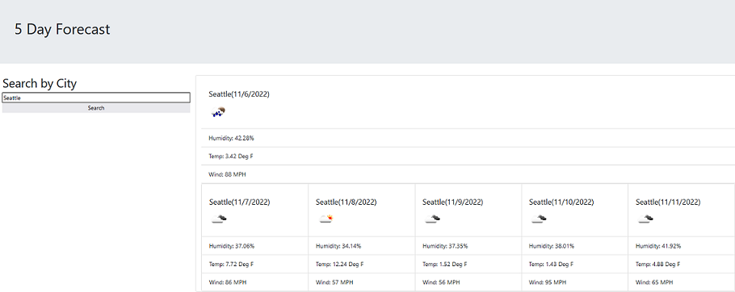

# Weather Search Dashboard

## Description

This web app is usefull for anyone trying to check basic weather information for today and the next 5 days.
You can search for any U.S. city it doesn't need to be where you are located right now. This app helps
plan a weekend out or decided how to pack for an upcoming vacation.

Working on this helped me gain more familiarity with the bootstrap css framework. I was also able to use
API calls for data, and even feed information from 1 api call into another.

## Installation

N/A

## Usage

To use this web application open it at: https://matwll.github.io/weather-search-dashboard/
Then type in a city name and click search.

## License

MIT Liscense